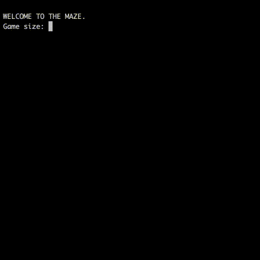

# MAZE

<script type="text/javascript" src="http://cdn.mathjax.org/mathjax/latest/MathJax.js?config=TeX-AMS-MML_HTMLorMML"></script>

## Introduction

This project creates a maze and allows the user to travel within it.
The player will have some number of steps to travel through the maze.
The number of steps is determined by the quadratic function
\\( t=\left\lfloor\frac{s^2}{8}+s+8\right\rfloor \\),
where t equals timer and s equals size.

## How it Works

The `main.cpp` file handles setup, getting game size, timer, and checking for game end.
It runs the `make_maze` function from the `Maze.cpp` file.
The `Maze.cpp` file generates a random maze. The maze is a **mathematical graph**, a *tree*.
All nodes can have *any number* of **child nodes**.
Trees of this format can be created by the `make_maze` function.
It uses the recursive `link_rooms` function to connect the start and end nodes *together*, with the call:
```cpp
link_rooms(0, n-1, &m, d);
```
Then `link_rooms` may call itself to connect room 0 to a, and a to n-1, and the process continues.
Upon victory, a **score** is calculated with the function 
\\( \left\lfloor d\times\ln{d}\times\frac{t}{m}\right\rfloor \\),
where t equals remaining time, m equals initial timer value, s equals size, and d equals difficulty.
Then, *if appropriate*, the **high score** is updated.
The high score is recorded in a file named *".hiscr"*.

## Interface

The UI involves a player first selecting a difficulty level and maze size.
A *larger difficulty level* automatically requires a *larger maze size*.
The player begins in the room at index `0`,
but after exiting they are never told **exactly** where they are.
By using the <ins>combination of *door colour* and *room colour* behind</ins>,
a player can *recognize* entrances to *previously accessed rooms*.
This allows players to choose new rooms,
as each unentered room could contain the exit.

The player is *never told* the index of the room they are in.
That's because higher-indexed rooms are *closer to the exit*,
allowing players recognize earlier that they went down a *dead end*.
The order of doors must also be shuffled, because it would allow cheating:
the correct door to enter from any room could be easily guessed.
For larger difficulty and maze sizes, one is likely to see:
two doors in a room that are identical, and that lead to identical rooms.
This is *quite intentional*, and why there are only 6 colours used.

## Room Colours

**Rooms now have colours!**
When you enter a room, rather than a *number*, you are told the *colour*.
Multiple rooms can have the same *colour*, so it can be **disorienting**.
When deciding *which room* to go to next,
the user will see the *colour* of a door **and** the room *behind* it.
Doors are always the *same colour on both sides*.
The colours of doors are accessed through a `Colour` structure,
to allow the *char array* to be used in a `vector`.
A room will store its colour in the `unsigned char room` property,
and those of all its doors in the `vector<unsigned char>doors` property.
Note that this stores only the index of the colour, not the full name.
This saves *negligible* memory but is done anyway as a **matter of principle**.
The *full names* of the colours are accessed in `door_colours` and `room_colours`.
Note that while these are *exactly the same*,
they are seperated to allow for *easy modification*.

## In Use


